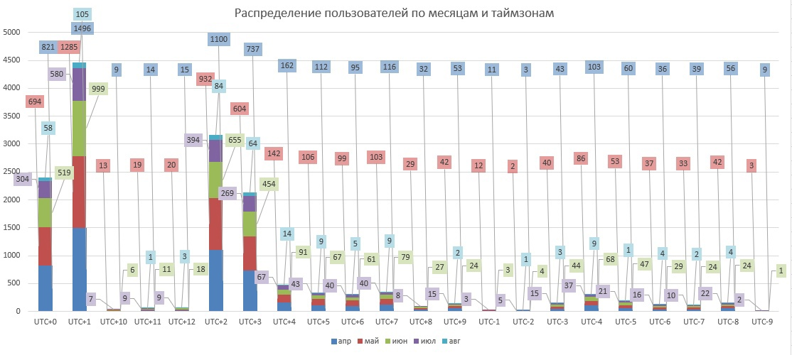
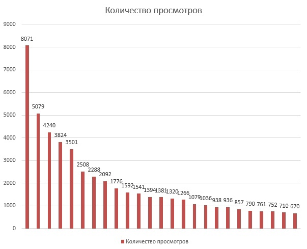
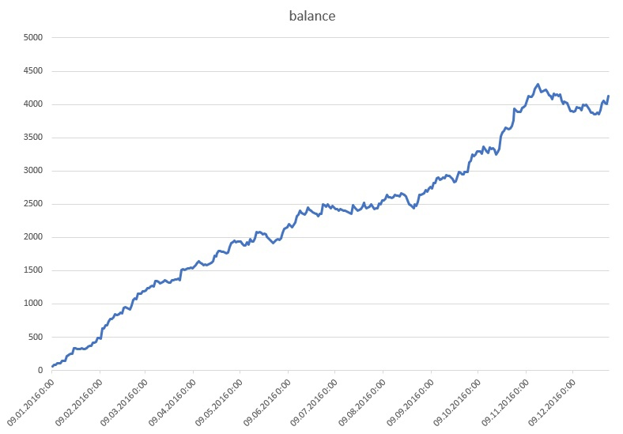

# Портфолио: аналитик данных

## Обо мне

Привет! Я учусь на третьем курсе НГТУ им. Р.Е. Алексеева, специальность "Атомные станции: проектировани, инжиниринг и эксплуатация".
Учусь на курсе "Аналитика данных" от SkyPro. 

## Навыки и технологии

 - **Инструменты анализа данных:** `SQL`, `Excel`:
 - **Языки программирования и библиотеки:** `Python`, `C++`
 - **Системы управления базами данных:** `PostgreSQL`

## Проекты

### [Проект №1.](https://github.com/Natasha1904/skypro_data_analyst/blob/main/coursework_excel/coursework.xlsx) Калькулятор юнит-экономики онлайн-кинотеатра

**Задачи:**

1. Нужно просчитать юнит-экономику продукта и предложить сценарий по настройке параметров для выхода на 25-ти процентную маржинальность.
2. Визуализировать какие пользователи, где и в каком объеме смотрят фильмы на платформе.

**Решение:** 

Рассчитала основные показатели, построила калькулятор в котором можно изменять эти данные, чтобы получить желаемый результат по маржинальности, построила визуализацию для исходных данных.

**Результаты:**

### [Проект №2.](https://github.com/Natasha1904/skypro_data_analyst/blob/main/coursework_sql/coursework.sql) Моделирование изменения балансов студентов

**Задачи:** 

1. Смоделировать изменение балансов студентов.
   > Баланс -- это количество уроков, которое есть у каждого студента.
3. Визуализировать результаты.

**Решение:**

Я разделила решение на 9 шагов, каждый из которых представляет собой мини-запрос. После чего, все эти шаги были объединены и
в результате получился запрос, который собирает данные о балансах студентов за каждый "прожитый" ими день. 

**Результаты:**

## Контакты

 - [VK](https://vk.com/n.latysheva2014)
 - [Email](nlatysheva9119@gmail.com)
